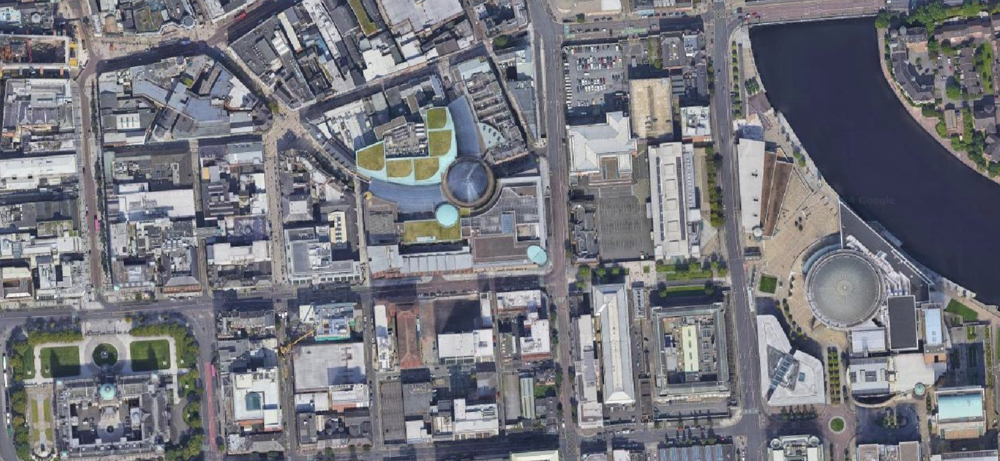
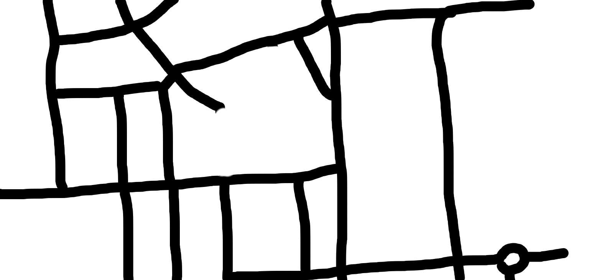

# Car driving simulation using TD3 

This repo demonstrates how to train a reinforcement learning model using Twin-Delayed Deep Deterministic (TD3) policy gradient. A city map and kivy package is used to create the environment for simulation. 

## YouTube Video of the inference simulation 
https://youtu.be/BBnNwP5SfuM

## New environment 
   

The above city map is used for training the simulation. Following mask is created to map the roads.   

   

There are 3 destinations on the map which are randomly selected in each turn and once selected shown with following icon on the map.   

   


## TD3 Model Training Techniques

A key feature of this model is its continuous action space. Instead of selecting from predefined options, the model predicts a continuous value used directly as an action. Specifically, it predicts an angle value to rotate the car, rather than choosing from a set of discrete angles. This continuous action space makes the training process more challenging. To address this, we've implemented several techniques and configurations:

1. **Replay Buffer**: We use a large replay buffer (500,000 samples) to store experiences. This ensures a diverse set of samples for training, including both positive and negative rewards.

2. **Initial Exploration**: The model starts training only after the replay buffer has collected a sufficient number of samples (defined by `initial_buffer`). This allows for a good mix of experiences before learning begins.

3. **Stuck Detection and Reset**: If the car remains in the same position for too long (defined by `stuck_patience`), it's considered stuck and is reset to a new random position. This prevents the agent from getting trapped in suboptimal states.

4. **Balanced Sampling**: Our `ReplayBuffer` class is designed to maintain a balance between positive and negative examples. It uses a `positive_sample_ratio` to ensure that each training batch contains a good mix of rewarding and challenging experiences.

5. **Adaptive Exploration**: The TD3 algorithm uses noise for exploration, which is gradually reduced over time. This allows for more random actions initially and more exploitative actions as the agent learns.

6. **Periodic Model Saving**: The model is saved at regular intervals (defined by `save_interval`). This allows for recovery of the best-performing model if training degrades over time.

7. **Flexible Running Modes**: The system supports different running modes (train, load, inference) controlled by the `RUN_MODE` environment variable. This allows for easy switching between training and evaluation.

8. **Dynamic Goal Setting**: When the car reaches a goal, a new random goal is set. This continually challenges the agent and promotes learning of general navigation skills rather than fixed routes.

These techniques work together to create a robust learning environment for the TD3 agent, allowing it to effectively learn in a continuous action space despite the inherent challenges.


## Reward Model

The reward model is a crucial component of our reinforcement learning system, designed to guide the car towards desired behaviors. The `get_reward` function calculates the reward based on several factors:

1. **Living Penalty**: A small negative reward for each step, encouraging the car to reach its goal efficiently.
   ```python
   new_reward -= 0.1  # Small penalty for each step
   ```

2. **Distance to Goal**: A penalty based on the car's distance from the goal, normalized by the screen's diagonal. This encourages the car to move towards the goal.
   ```python
   screen_diagonal = np.sqrt(self.width**2 + self.height**2)
   new_reward -= distance / screen_diagonal
   ```

3. **Goal Achievement**: A large positive reward for reaching the goal (when distance < 25 units).
   ```python
   if distance < 25:
       new_reward += 50  # Large reward for reaching the goal
   ```

4. **Road Following**: 
   - A significant penalty for being off-road, which also reduces the car's velocity.
   - A positive reward for staying on the road, with an additional reward for moving towards the goal while on the road.
   ```python
   if sand[x, y] > 0:
       new_reward -= 10  # Larger penalty for being off-road
       self.car.velocity = Vector(0.5, 0).rotate(self.car.angle)
   else:
       new_reward += 2  # Increased positive reward for staying on the road
       self.car.velocity = Vector(2, 0).rotate(self.car.angle)
       if distance < self.last_distance: 
           new_reward += 1  # Increased reward for moving towards the goal while on the road
   ```

5. **Turn Penalty**: A small penalty for turning, normalized by a full rotation, to encourage smoother driving.
   ```python
   angle_change = abs(self.car.angle - self.last_angle)
   new_reward -= 0.1 * angle_change / 360  # Normalize by full rotation
   ```

6. **Edge Avoidance**: A penalty for getting too close to the edges of the map, increasing as the car gets closer to the edge.
   ```python
   edge_distance = min(x, y, self.width - x - 1, self.height - y - 1)
   if edge_distance < 50:
       new_reward -= (50 - edge_distance) / 5  # Increased penalty
   ```

This reward structure is designed to balance multiple objectives:
- Reaching the goal efficiently
- Staying on the road
- Avoiding edges of the map
- Maintaining smooth movement

The relative weights of these components have been tuned to encourage the car to learn a driving policy that effectively navigates to the goal while following the road and avoiding obstacles. Further fine-tuning of these weights may be necessary based on observed behavior during training.

## Possible Improvements

Based on observed training behavior and reward analysis, several potential improvements could enhance the model's performance and stability:

1. **Checkpointing**: Implement regular model saving during training. This allows reverting to previous good states if performance degrades.

2. **Adaptive Exploration**: Implement a decaying epsilon-greedy strategy or another adaptive exploration method to balance exploration and exploitation over time.

3. **Early Stopping**: Implement a mechanism to stop training and revert to the best performing model if performance consistently degrades.

4. **Performance Analysis Tools**:
   - Implement logging of detailed per-episode statistics.
   - Create visualizations (e.g., moving average of rewards) to track performance trends.

5. **Reward Shaping**: Dynamically adjust rewards based on the agent's current performance level to provide appropriate challenge.

Implementation of these improvements should be done incrementally, with careful monitoring of their impact on the agent's performance.

